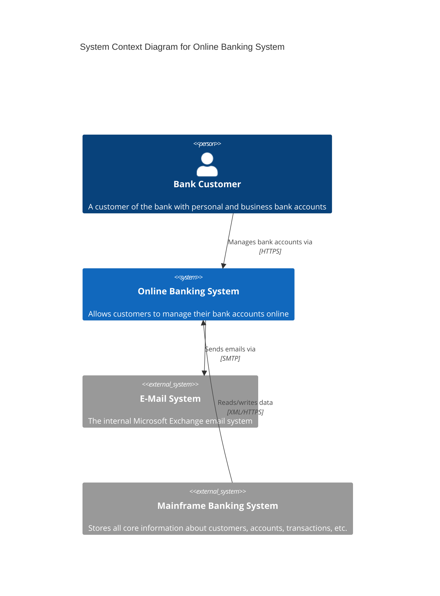
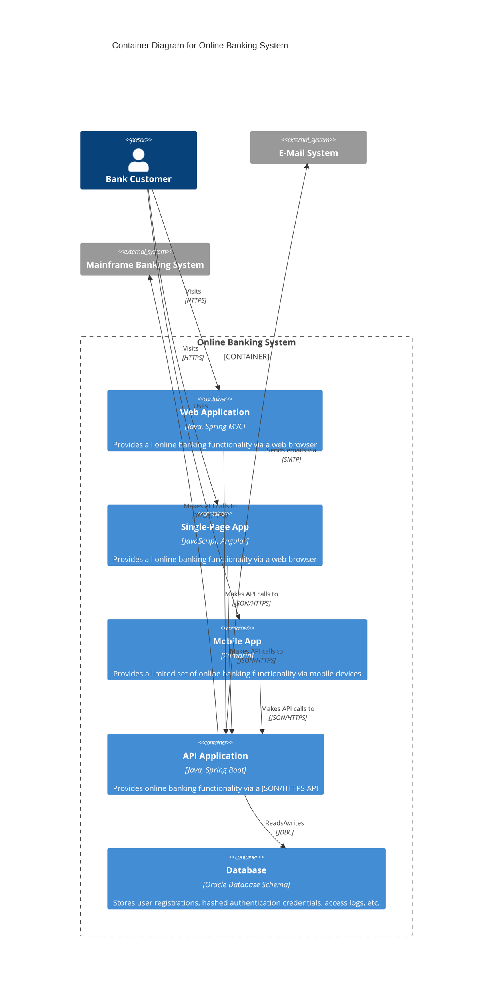
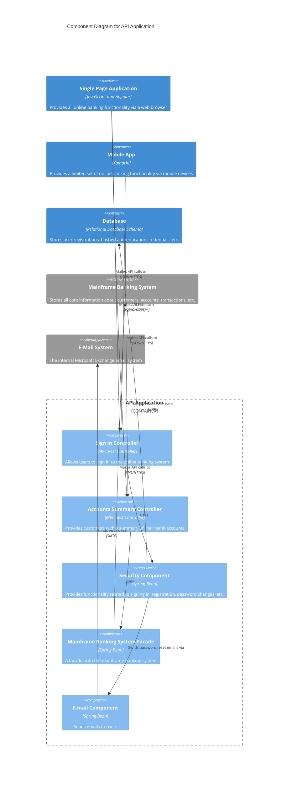
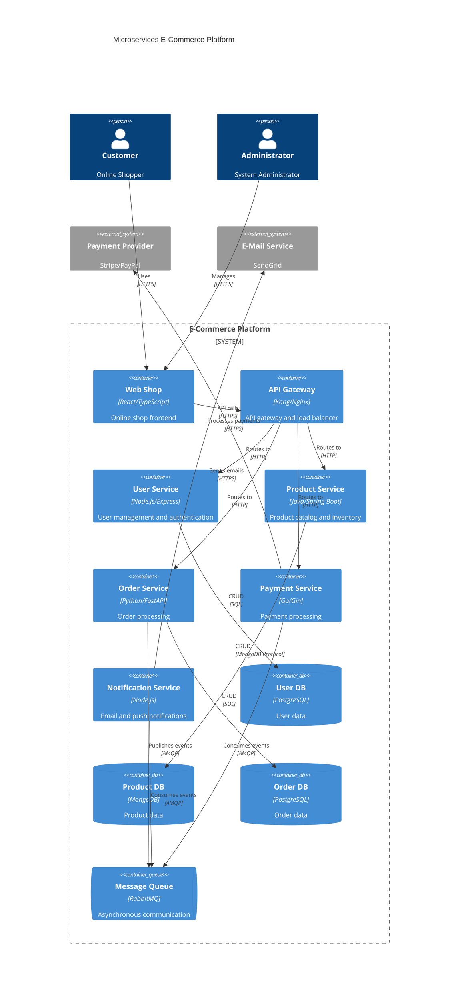
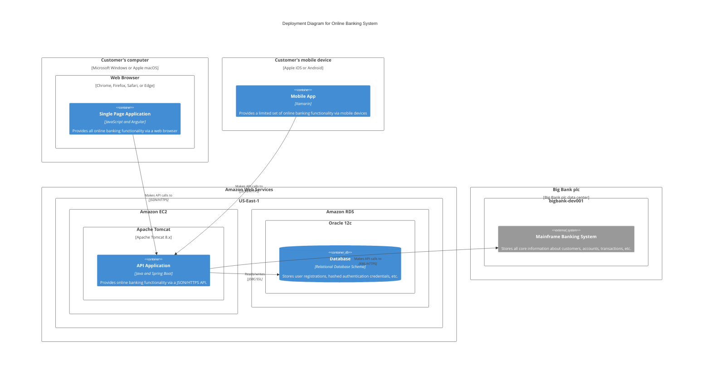

# Mermaid C4 Diagram Examples

This document shows various examples of C4 diagrams using Mermaid.

## C4 Context Diagram (Level 1)

The Context diagram shows the system overview and its relationships to external systems and users.

## C4 Container Diagram (Level 2)

The Container diagram shows the high-level structure of the system and the distribution of responsibilities.

## C4 Component Diagram (Level 3)

The Component diagram shows the internal structure of a container.

## Microservices Architecture Example

Another example shows a modern microservices architecture:

## Deployment Diagram

A C4 Deployment diagram shows the physical infrastructure:

These examples show the different levels of the C4 model and how they can be represented with Mermaid. Each level offers different levels of detail and targets different audiences.