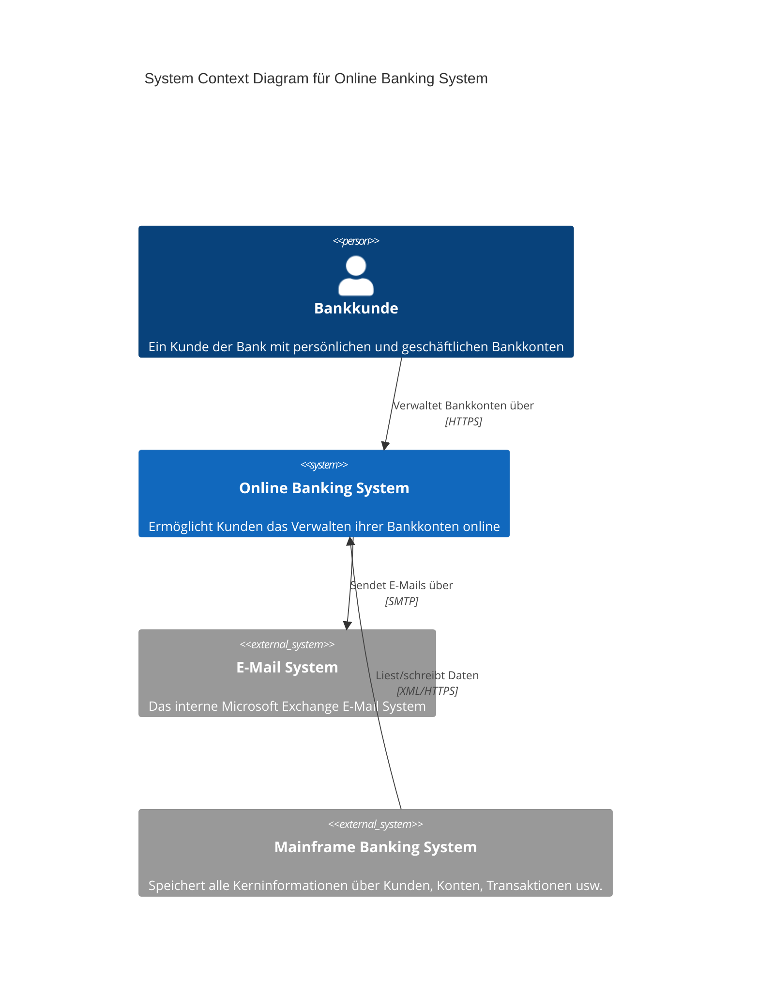
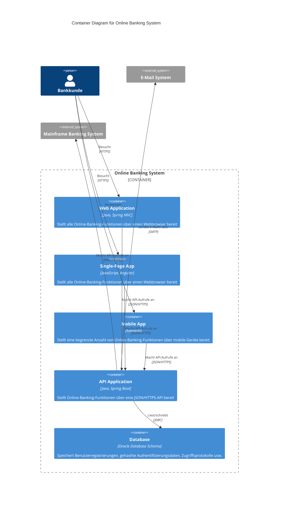
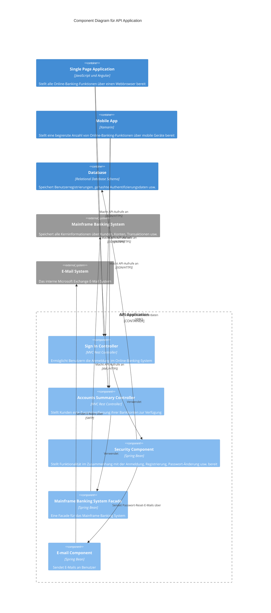
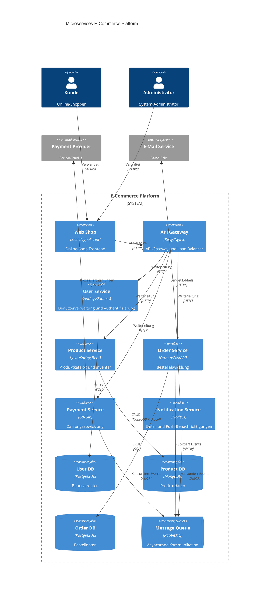
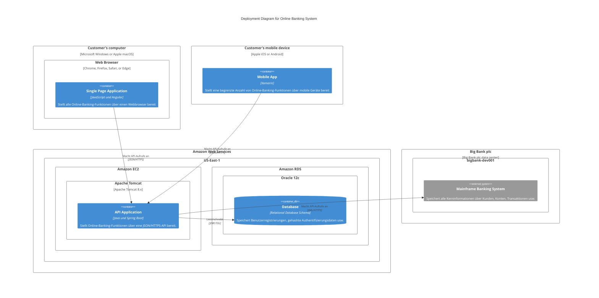

# Mermaid C4 Diagramm Beispiele

Dieses Dokument zeigt verschiedene Beispiele für C4-Diagramme mit Mermaid.

## C4 Context Diagramm (Level 1)

Das Context-Diagramm zeigt das System im Überblick und seine Beziehungen zu externen Systemen und Benutzern.

## C4 Container Diagramm (Level 2)

Das Container-Diagramm zeigt die Struktur des Systems auf hoher Ebene und die Verteilung der Verantwortlichkeiten.

## C4 Component Diagramm (Level 3)

Das Component-Diagramm zeigt die interne Struktur eines Containers.

## Microservices Architektur Beispiel

Ein weiteres Beispiel zeigt eine moderne Microservices-Architektur:

## Deployment Diagramm

Ein C4 Deployment-Diagramm zeigt die physische Infrastruktur:

Diese Beispiele zeigen die verschiedenen Ebenen des C4-Modells und wie sie mit Mermaid dargestellt werden können. Jede Ebene bietet unterschiedliche Detailgrade und richtet sich an verschiedene Zielgruppen.